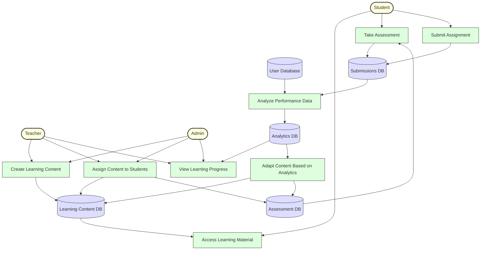

```mermaid
flowchart TD
    %% Main Actors
    Student([Student])
    Teacher([Teacher])
    Admin([Admin])
    
    %% Main Data Flow Processes
    CreateContent[Create Learning Content]
    AssignContent[Assign Content to Students]
    LearnContent[Access Learning Material]
    TakeAssessment[Take Assessment]
    SubmitAssignment[Submit Assignment]
    ViewProgress[View Learning Progress]
    Analyze[Analyze Performance Data]
    Adapt[Adapt Content Based on Analytics]
    
    %% Data Stores
    UserDB[(User Database)]
    LearningDB[(Learning Content DB)]
    AssessmentDB[(Assessment DB)]
    SubmissionDB[(Submissions DB)]
    AnalyticsDB[(Analytics DB)]
    
    %% Flow Connections - Content Creation & Assignment
    Teacher --> CreateContent
    Admin --> CreateContent
    CreateContent --> LearningDB
    
    Teacher --> AssignContent
    Admin --> AssignContent
    AssignContent --> LearningDB
    AssignContent --> AssessmentDB
    
    %% Flow Connections - Learning & Assessment
    Student --> LearnContent
    LearningDB --> LearnContent
    
    Student --> TakeAssessment
    AssessmentDB --> TakeAssessment
    TakeAssessment --> SubmissionDB
    
    Student --> SubmitAssignment
    SubmitAssignment --> SubmissionDB
    
    %% Flow Connections - Analytics & Adaptation
    SubmissionDB --> Analyze
    UserDB --> Analyze
    Analyze --> AnalyticsDB
    
    Teacher --> ViewProgress
    Admin --> ViewProgress
    AnalyticsDB --> ViewProgress
    
    AnalyticsDB --> Adapt
    Adapt --> LearningDB
    Adapt --> AssessmentDB
    
    %% Styling
    classDef actor fill:#ffd,stroke:#333,stroke-width:2px
    classDef process fill:#dfd,stroke:#333,stroke-width:1px
    classDef datastore fill:#ddf,stroke:#333,stroke-width:1px
    
    class Student,Teacher,Admin actor
    class CreateContent,AssignContent,LearnContent,TakeAssessment,SubmitAssignment,ViewProgress,Analyze,Adapt process
    class UserDB,LearningDB,AssessmentDB,SubmissionDB,AnalyticsDB datastore
``` 