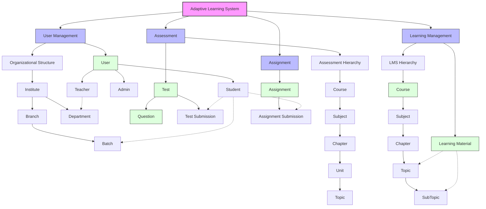

```mermaid
graph TD
    %% Main System Components
    AdaptiveLearning[Adaptive Learning System]
    
    %% First Level Components
    AdaptiveLearning --> UserModule[User Management]
    AdaptiveLearning --> AssessmentModule[Assessment]
    AdaptiveLearning --> AssignmentModule[Assignment]
    AdaptiveLearning --> LMSModule[Learning Management]
    
    %% User Management Branch
    UserModule --> User[User]
    User --> Student[Student]
    User --> Teacher[Teacher]
    User --> Admin[Admin]
    
    %% Organizational Structure
    UserModule --> OrgStructure[Organizational Structure]
    OrgStructure --> Institute[Institute]
    Institute --> Branch[Branch]
    Branch --> Batch[Batch]
    Institute --> Department[Department]
    
    %% Assessment Branch
    AssessmentModule --> Test[Test]
    Test --> Question[Question]
    Test --> SubmitTest[Test Submission]
    
    AssessmentModule --> AssessmentHierarchy[Assessment Hierarchy]
    AssessmentHierarchy --> CourseV2[Course]
    CourseV2 --> SubjectV2[Subject]
    SubjectV2 --> ChapterV2[Chapter]
    ChapterV2 --> UnitV2[Unit]
    UnitV2 --> TopicV2[Topic]
    
    %% Assignment Branch
    AssignmentModule --> Assignment[Assignment]
    Assignment --> AssignmentSubmission[Assignment Submission]
    
    %% LMS Branch
    LMSModule --> LMSHierarchy[LMS Hierarchy]
    LMSHierarchy --> LMSCourse[Course]
    LMSCourse --> LMSSubject[Subject]
    LMSSubject --> LMSChapter[Chapter]
    LMSChapter --> LMSTopic[Topic]
    LMSTopic --> LMSSubTopic[SubTopic]
    
    LMSModule --> Material[Learning Material]
    
    %% Key Relationships (cross-module)
    Student -.-> Batch
    Teacher -.-> Department
    Student -.-> SubmitTest
    Student -.-> AssignmentSubmission
    Material -.-> LMSTopic
    Material -.-> LMSSubTopic
    
    %% Styling
    classDef mainSystem fill:#f9f,stroke:#333,stroke-width:2px
    classDef modules fill:#bbf,stroke:#333,stroke-width:1px
    classDef entities fill:#dfd,stroke:#333,stroke-width:1px
    
    class AdaptiveLearning mainSystem
    class UserModule,AssessmentModule,AssignmentModule,LMSModule modules
    class User,Test,Question,Assignment,LMSCourse,Material entities
``` 